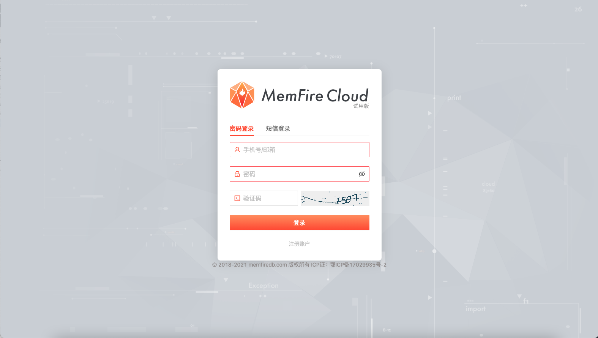
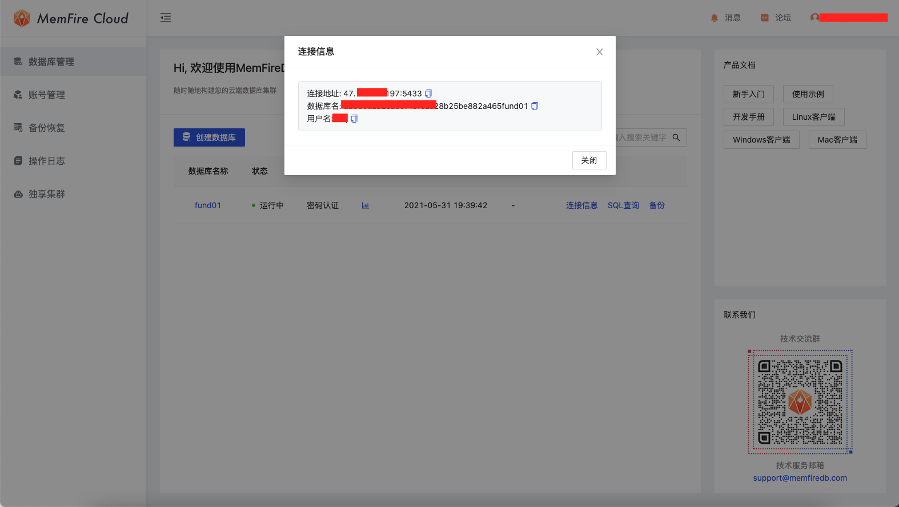
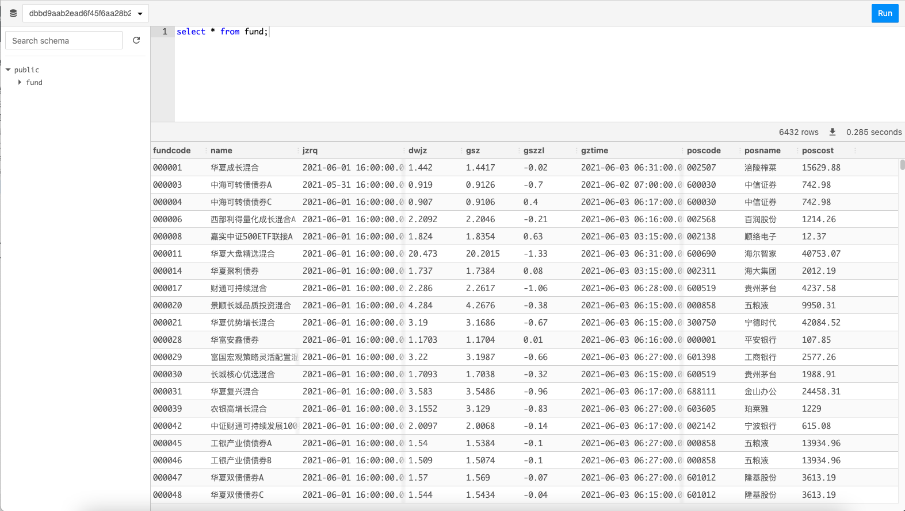
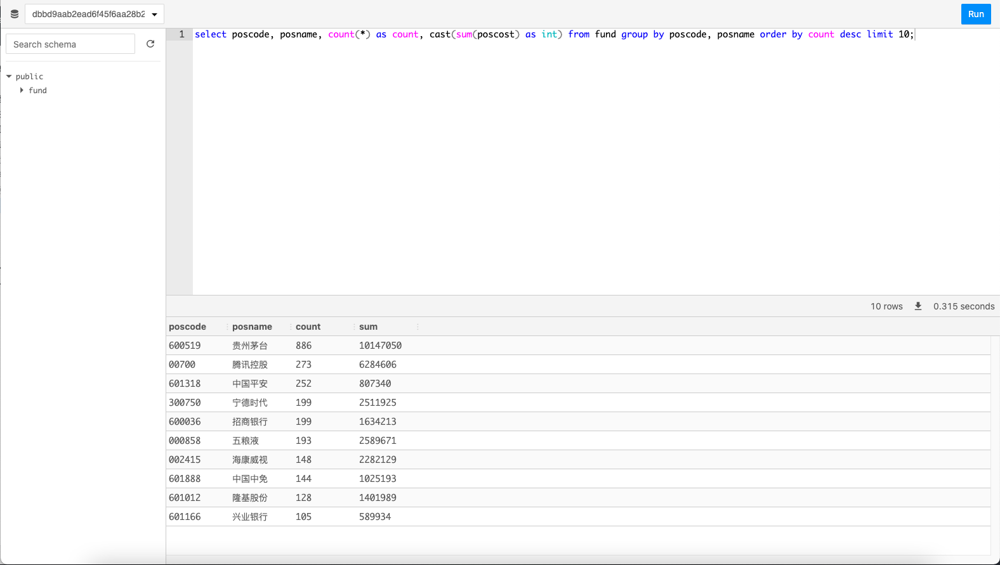

# 爬取6000多个基金信息后，终于知道基金经理们最爱买的那只股票原来是它！

最近基金非常火爆，很多原本不投资、不理财人，也开始讨论、参与买基金了。

根据投资对象的不同，基金分为股票型基金、债券基金、混合型基金、货币基金。

其中股票型基金说白了，就是我们把钱交给基金公司让它们来帮我们买股票，毕竟人家专业些嘛。

所以今天我们就来看看，这些基金公司都喜欢买那些公司的股票。

接下来我们自己动手，从天天基金网获取基金数据来分析，文章末尾可以获得全量代码地址；

## 所用到的技术

+ IP代理池
+ 多线程
+ 爬虫
+ sql

## 开始编写爬虫

1. 首先，开始分析天天基金网的一些数据。经过抓包分析，可知: `./fundcode_search.js`包含所有基金代码的数据。
2. 根据基金代码，访问地址: `fundgz.1234567.com.cn/js/ + 基金代码 + .js`可以获取基金实时净值和估值信息。
3. 根据基金代码，访问地址: `fundf10.eastmoney.com/FundArchivesDatas.aspx?type=jjcc&code= + 基金代码 + &topline=10&year=2021&month=3`可以获取第一季度该基金所持仓的股票。
4. 由于这些地址具有反爬机制，多次访问将会失败的情况。所以需要搭建IP代理池，用于反爬。搭建很简单，只需要将[proxy_pool](https://github.com/jhao104/proxy_pool)这个项目跑起来就行了。
    ```python
    # 通过这个方法就能获取代理
    def get_proxy():
        return requests.get("http://127.0.0.1:5010/get/").json()
    ```
5. 搭建完IP代理池后，我们开始着手多线程爬取数据的工作。使用多线程，需要考虑到数据的读写顺序问题。这里使用python中的队列queue存储基金代码，不同线程分别从这个queue中获取基金代码，并访问指定基金的数据。因为queue的读取和写入是阻塞的，所以可确保该过程不会出现读取重复和读取丢失基金代码的情况。
    ```python
    # 获取所有基金代码
    fund_code_list = get_fund_code()
    fund_len = len(fund_code_list)

    # 创建一个队列
    fund_code_queue = queue.Queue(fund_len)
    # 写入基金代码数据到队列
    for i in range(fund_len):
        # fund_code_list[i]也是list类型，其中该list中的第0个元素存放基金代码
        fund_code_queue.put(fund_code_list[i][0])
    ```
6. 现在开始编写获取所有基金的代码。
    ```python
    # 获取所有基金代码
    def get_fund_code():
        ...

        # 访问网页接口
        req = requests.get("http://fund.eastmoney.com/js/fundcode_search.js",
                        timeout=5,
                        headers=header)

        # 解析出基金代码存入list中
        ...

        return fund_code_list
    ```
7. 接下来是从队列中取出基金代码，同时获取基金详情和基金持仓的股票。
    ```python
    # 当队列不为空时
    while not fund_code_queue.empty():

        # 从队列读取一个基金代码
        # 读取是阻塞操作
        fund_code = fund_code_queue.get()

        ...

        try:
            # 使用该基金代码进行基金详情和股票持仓请求
            ...
    ```
8. 获取基金详情
    ```python
    # 使用代理访问
    req = requests.get(
        "http://fundgz.1234567.com.cn/js/" + str(fund_code) + ".js",
        proxies={"http": "http://{}".format(proxy)},
        timeout=3,
        headers=header,
    )
    # 解析返回数据
    ...
    ```
9. 获取持仓股票信息
    ```python
    # 获取股票投资明细
    req = requests.get(
        "http://fundf10.eastmoney.com/FundArchivesDatas.aspx?type=jjcc&code="
        + str(fund_code) + "&topline=10&year=2021&month=3",
        proxies={"http": "http://{}".format(proxy)},
        timeout=3,
        headers=header,
    )
    # 解析返回数据
    ...
    ```
10. 准备一个数据库，用于存储数据和对数据进行筛选分析。这里推荐一个方便的云数据库，一键创建，一键查询，十分方便，而且是免费的哦。前往[MemFireDB](https://memfiredb.com/?utm_source=hwj)注册一个账号就能使用。注册邀请码：```6mxJl6```、```6mYjGY```；
    
11. 创建好数据库后，点击连接信息填入代码中，用于连接数据库。
    
    ```python
    # 初始化数据库连接:
    engine = create_engine(
    'postgresql+psycopg2://username:password@ip:5433/dbname')
    ```
12. 将数据写入数据库中。
    ```python
    with get_session() as s:
        # create fund
        ...

        if (create):
            s.add(fund)

        s.commit()
    ```
13. 到这里，大部分工作已经完成了，我们在main函数中开启线程，开始爬取。
    ```python
    # 在一定范围内，线程数越多，速度越快
    for i in range(50):
        t = threading.Thread(target=get_fund_data, name="LoopThread" + str(i))
        t.start()
    ```
14. 等到爬虫运行完成之后，我们打开`MemFireDB`，点击对应数据库的`SQL查询`按钮，就可以查看我们爬取的数据。哇！我们获取到了6432条数据。
    
15. 接下来让我们来看看这些基金最喜欢买哪些股票吧。输入`SQL`语句`select poscode, posname, count(*) as count, cast(sum(poscost) as int) from fund group by poscode, posname order by count desc limit 10;`
    

它就是茅台！

在`MemFireDB`平台可以很方便的进行SQL查询操作，大家自由发挥进行分析，其他我就不多说了，[代码地址]()。

茅台真牛X！
